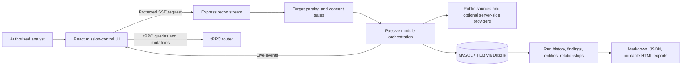

# ReconGPT

**ReconGPT** is an evidence-first OSINT mission-control workspace for **authorized, public-information reconnaissance**. It combines a React analyst console with a server-orchestrated passive collection pipeline, live Server-Sent Events (SSE), source-linked findings, an entity graph, run history, and Markdown, JSON, and printable HTML reporting.

[](LICENSE)

[Live workspace](#usage) · [Architecture](#architecture) · [Security boundaries](#security-and-safe-use) · [Report an issue](https://github.com/vincenzo-afk/ReconGPT/issues) · [Request a feature](https://github.com/vincenzo-afk/ReconGPT/issues/new)

> **Authorized use only.** ReconGPT is intended for asset inventory, incident response, due diligence, and security assessment of systems, data, and communities for which the analyst has authorization. It intentionally excludes active port scanning, password recovery, authentication probing, credential collection, private-account access, social engineering, and direct onion-site crawling.

---

## Table of contents

- [About](#about)
- [Architecture](#architecture)
- [Capabilities and evidence boundaries](#capabilities-and-evidence-boundaries)
- [Technology stack](#technology-stack)
- [Getting started](#getting-started)
- [Configuration](#configuration)
- [Usage](#usage)
- [Operational API surface](#operational-api-surface)
- [Project structure](#project-structure)
- [Testing and quality checks](#testing-and-quality-checks)
- [Deployment](#deployment)
- [Security and safe use](#security-and-safe-use)
- [Contributing](#contributing)
- [License](#license)
- [Acknowledgments](#acknowledgments)

---

## About

ReconGPT gives authorized analysts a single place to collect, interpret, compare, and export passive evidence about domains, IP addresses, URLs, companies, ASNs, public usernames, and authorized email addresses. Each module produces normalized findings with source URLs, confidence, evidence quality, freshness, limitations, sensitivity, retention handling, and review status. The analyst interface renders evidence safely as GitHub-Flavored Markdown (GFM), tracks source coverage, and distinguishes observed facts from manual research leads.

The project is deliberately conservative. A result marked **lead** is a review prompt, not an attribution or exposure claim. An empty public-source response is not treated as evidence of absence. Provider credentials remain server-side, and the browser receives only configured-state information.

### What is included

| Area | Implemented behavior | Important boundary |
|---|---|---|
| Domain and network posture | Certificate Transparency, DNS and email-authentication posture, RDAP, TLS, HTTP metadata, IP/ASN context, BGP/RPKI context, and provider-backed reputation where configured. | No active port scan or private-network access. |
| Public web research | Robots-aware same-origin collection, `robots.txt`, `sitemap.xml`, `security.txt`, Wayback, Common Crawl, public search adapters, document metadata, and source coverage telemetry. | Fixed page, timeout, MIME, redirect, deduplication, and private-address limits are enforced. |
| Identity and social research | A bounded 100+ public-platform username catalogue, public social-profile review links, public GitHub context, and consent-bound public email posture. | It does not perform sign-up, password reset, login, account-registration, or hidden-contact enumeration. |
| Media metadata | Authenticated analysts can inspect supplied JPEG, PNG, WebP, or TIFF metadata locally through a size- and MIME-bounded endpoint. | Original media is not persisted; sensitive location data is redacted in results. |
| Historical and defensive research | Certificate timelines, historical web-change comparison, public advisory pivots, supply-chain metadata, defensive brand leads, and public onion-index search leads. | Onion leads are links only; ReconGPT never opens, crawls, downloads, or stores onion content. |
| Community integrations | Administrator-only selected-scope controls for future Discord and Telegram connectors, with pause, purge, retention, and audit metadata. | The connector is disabled by default and stores no community messages or member data. |

### Architecture



Recon runs begin at the authenticated `GET /api/recon/stream` endpoint. The server validates target type, authorization declarations, selected modules, and community settings before orchestrating applicable passive modules. Module lifecycle events are written to persistence and streamed as SSE records. The UI uses tRPC for authenticated history, settings, AI analysis, community-control administration, and ephemeral metadata inspection.

---

## Capabilities and evidence boundaries

ReconGPT uses evidence metadata to help analysts decide what needs review. A finding’s confidence is a collection-quality signal, not proof of ownership, intent, compromise, or identity.

| Evidence field | Meaning |
|---|---|
| `evidenceQuality` | Distinguishes corroborated evidence, contextual data, and manual-review leads. |
| `leadStatus` | Identifies whether a result is verified, needs review, or was excluded. |
| `sourceCount` and `collectedAt` | Make source breadth and time context explicit. |
| `limitations` | Records source-specific gaps and non-claims. |
| Sensitivity and retention | Labels public, contact, location, community, or media handling and redaction/retention behavior. |

### Optional provider integrations

Provider calls are available only when their server-side secret is configured. Missing providers degrade to an explicit availability notice rather than a fabricated result.

| Provider | Use in ReconGPT | Documentation |
|---|---|---|
| Shodan | Historical public host context | [Shodan developer API](https://developer.shodan.io/) |
| VirusTotal | Domain or IP reputation context | [VirusTotal API](https://docs.virustotal.com/) |
| AbuseIPDB | IP abuse-report context | [AbuseIPDB API](https://docs.abuseipdb.com/) |
| urlscan.io | Public scan-history context | [urlscan.io API](https://urlscan.io/docs/api/) |
| IPinfo | Network ownership and location context | [IPinfo developer docs](https://ipinfo.io/developers) |

---

## Technology stack

| Layer | Technology verified in this repository |
|---|---|
| Frontend | React 19, TypeScript 5.9, Vite 7, Tailwind CSS 4, TanStack Query 5, Wouter 3, React Markdown 10 with `remark-gfm`. |
| Backend | Node.js, Express 4, tRPC 11, Zod 4, Server-Sent Events, `tsx`. |
| Data | MySQL-compatible database or TiDB, Drizzle ORM 0.44 and Drizzle Kit 0.31. |
| Public-source handling | Cheerio, `robots-parser`, `tldts`, and `exifr`. |
| Testing and build | Vitest 2, TypeScript compiler checks, Vite, and esbuild. |
| Authentication and storage | Manus OAuth framework integration and optional S3 helpers. |

---

## Getting started

### Prerequisites

Use a current Node.js release compatible with the project’s `pnpm@10.4.1` package-manager declaration. A MySQL-compatible database is required for persisted runs, and a configured OAuth environment is required for protected user workflows.

```bash
node --version
corepack enable
corepack prepare pnpm@10.4.1 --activate
```

### Install and run locally

```bash
git clone https://github.com/vincenzo-afk/ReconGPT.git
cd ReconGPT
pnpm install
pnpm dev
```

The development entry point is `server/_core/index.ts`; it starts the Express application and Vite-backed client on `PORT`, defaulting to `3000`.

### Database migration

Review generated migration SQL before applying it in production. The repository script is:

```bash
pnpm db:push
```

---

## Configuration

Never commit `.env` files, service tokens, API keys, cookies, or OAuth secrets. In the managed deployment, configure these values through the project’s secure secret settings. For a self-hosted setup, inject equivalent values through the hosting environment.

| Variable | Required | Purpose |
|---|---:|---|
| `DATABASE_URL` | Yes | MySQL-compatible database connection string. |
| `JWT_SECRET` | Yes | Server session-cookie signing secret. |
| `VITE_APP_ID` | Yes for OAuth | OAuth application identifier. |
| `OAUTH_SERVER_URL` | Yes for OAuth | OAuth server base URL. |
| `OWNER_OPEN_ID` | Deployment dependent | Configured workspace owner identity. |
| `BUILT_IN_FORGE_API_URL` | Managed deployment | Server-side built-in service endpoint. |
| `BUILT_IN_FORGE_API_KEY` | Managed deployment | Server-side built-in service credential. |
| `SHODAN_API_KEY` | Optional | Enables Shodan context. |
| `VIRUSTOTAL_API_KEY` | Optional | Enables VirusTotal context. |
| `ABUSEIPDB_API_KEY` | Optional | Enables AbuseIPDB context. |
| `URLSCAN_API_KEY` | Optional | Enables authenticated urlscan.io history. |
| `IPINFO_API_KEY` or `IPINFO_TOKEN` | Optional | Enables IPinfo context. |
| `EXTERNAL_LLM_API_KEY` | Optional | Reserved for a separately configured external analysis provider. |
| `PORT` | Optional | Express port; defaults to `3000`. |
| `NODE_ENV` | Optional | Set to `production` for `pnpm start`. |
| `RUN_LIVE_PROVIDER_TESTS` | Optional | Set to `true` only for deliberate live-provider smoke checks. Standard tests do not call providers. |

---

## Usage

After signing in, enter an authorized target in the terminal-style command deck and choose a permitted research intensity. ReconGPT validates the target, enables only applicable modules, and streams progress in real time. Use the findings explorer and entity graph to review source-linked evidence; use run comparison for authorized monitoring; export only after checking limitations and evidence quality.

### Identity and media controls

Identity-adjacent functions require explicit consent controls in the UI. Confirming email authorization permits only bounded checks against documented public identity endpoints; it does not enable account enumeration. Image inspection requires confirmation that the analyst is authorized to inspect the supplied file. The media endpoint accepts JPEG, PNG, WebP, and TIFF payloads up to the enforced request limit and returns redacted metadata without persisting the original image.

### Community controls

The Discord and Telegram panel is visible only to administrators. An administrator can define up to ten selected scopes, set a retention period from 1 to 30 days, pause the scaffold, and purge its saved selected-scope configuration. Enabling a selected scope does **not** deploy a bot or begin collection; a future provider connector would require its own installation, terms review, and explicit authorization.

---

## Operational API surface

ReconGPT is an authenticated workspace rather than a public reconnaissance API. The browser consumes tRPC procedures under `/api/trpc`; the live collection endpoint is SSE.

| Interface | Authentication | Purpose |
|---|---|---|
| `GET /api/recon/stream` | Required | Validates a recon request and streams queued, started, finding, notice, completed, or failed events. |
| `/api/trpc/recon.*` | Required except module catalogue | Lists, retrieves, and compares stored runs; exposes module and provider status. |
| `/api/trpc/settings.*` | Required; community mutations require administrator role | Manages analyst settings and selected-scope community control metadata. |
| `/api/trpc/media.inspectMetadata` | Required plus explicit media authorization | Performs bounded, non-persistent image metadata extraction. |
| `/api/trpc/ai.chat` | Required | Produces evidence-first analyst guidance with safe-use constraints. |

The SSE request accepts validated target, optional context, intensity, enabled-module selection, and explicit authorization flags. It rejects invalid requests before module execution.

---

## Project structure

```text
ReconGPT/
├── client/
│   └── src/
│       ├── components/        # Mission-control, graph, Markdown, UI components
│       ├── lib/               # tRPC client and report export helpers
│       └── pages/Home.tsx     # Primary analyst workspace
├── drizzle/
│   ├── schema.ts              # MySQL/Drizzle records and entity types
│   └── *.sql                  # Generated, reviewed database migrations
├── server/
│   ├── _core/                 # Express, OAuth, environment, tRPC, Vite bridge
│   ├── recon/                 # Targets, modules, policy gates, service, SSE, tests
│   ├── db.ts                  # Persistence helpers
│   └── routers.ts             # Authenticated tRPC contracts
├── shared/                    # Shared constants and types
├── package.json               # Scripts, runtime dependencies, toolchain
├── vitest.config.ts           # Test discovery and configuration
└── README.md                  # This document
```

The normalized data model persists users, recon runs, recon events, recon entities, entity relationships, and analyst settings. Entity types include domain, subdomain, IP, email, username, organization, URL, certificate, ASN, phone, social profile, media, location signal, and community records.

---

## Testing and quality checks

Run the project’s verified release checks from the repository root.

```bash
pnpm test
pnpm check
NODE_OPTIONS='--max-old-space-size=768' pnpm build
```

The Vitest suite covers target parsing, passive-module routing, crawler safety, public-suffix handling, evidence metadata, report rendering, Markdown sanitization, credential-boundary behavior, community-control gating, identity consent, username limits, and media validation. Live provider checks are intentionally opt-in with `RUN_LIVE_PROVIDER_TESTS=true`.

This repository does not include a CI workflow or container definition. Add those only after deciding the target deployment environment and secret-injection model.

---

## Deployment

Build and start the Node.js application with the repository scripts:

```bash
pnpm build
NODE_ENV=production pnpm start
```

Configure the database, OAuth values, and optional provider credentials in the deployment platform’s secret manager. Do not use a custom Dockerfile unless production requires additional operating-system packages; the app’s normal Node build does not require one.

---

## Security and safe use

ReconGPT applies the following controls in code:

- **Authentication and authorization:** protected procedures use the configured OAuth session; community configuration and purge operations use an administrator procedure.
- **Server-only credentials:** provider keys are read from the server environment and are never returned in run data, settings, exports, or browser configuration.
- **Public-web boundaries:** the crawler rejects non-HTTP(S) schemes, local/internal hostnames, and private-address destinations; it respects `robots.txt`, request budgets, redirects, type limits, and response-size limits.
- **Consent gates:** identity and media operations require explicit authorization flags. Community integration is disabled by default and selected-scope configuration is administrator-gated.
- **Sensitive evidence handling:** identity findings carry sensitivity, consent-basis, redaction, retention, source-count, freshness, and limitation metadata. Original inspected media is not stored.
- **Safe rendering:** analyst Markdown uses a non-raw HTML renderer with GitHub-Flavored Markdown support.

If you discover a security vulnerability, please open a private report with the repository owner rather than publishing exploit details in a public issue. Do not submit real keys, tokens, customer data, or private evidence to the issue tracker.

---

## Contributing

Use a short-lived branch, keep changes scoped, and include deterministic tests for module, policy, or rendering changes. Run `pnpm test`, `pnpm check`, and `pnpm build` before opening a pull request. Prefer conventional commit prefixes such as `feat:`, `fix:`, `test:`, and `docs:`.

All contributions must preserve ReconGPT’s passive-collection, public-source, authorization, and no-secret-in-client boundaries.

---

## License

This project is licensed under the [MIT License](LICENSE), as declared in `package.json`.

---

## Acknowledgments

ReconGPT uses established public research resources and provider APIs, including [Certificate Transparency via crt.sh](https://crt.sh/), [RDAP](https://www.icann.org/rdap), the [Internet Archive CDX API](https://archive.org/help/wayback_api.php), [Common Crawl](https://commoncrawl.org/), and the optional provider integrations listed above. The frontend is built with React, tRPC, Drizzle, Tailwind CSS, and the libraries listed in `package.json`.

---

<p align="center"><a href="#recongpt">Back to top</a></p>

Built for **authorized, evidence-led public research** by the ReconGPT contributors.
